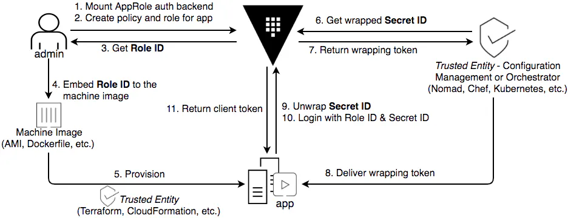

# [Vault Integration] Application AppRole <=> GitHub Actions CI

---

## REQUIREMENTS
#### HASHICORP
- [HashiCorp Vault](https://www.hashicorp.com/products/vault) & [Vault CLI](https://developer.hashicorp.com/vault/tutorials/getting-started/getting-started-install)
- [HashiCorp Terraform](https://developer.hashicorp.com/terraform/install)
#### GITHUB
- GitHub Repo
- GitHub Actions
#### CONTAINER
- Image Repository

#### PREREQ INPUTS
- Vault:
  - `VAULT_ADDR`
  - `VAULT_TOKEN`
  - `VAULT_NAMESPACE`
- GitHub
  - `GITHUB_TOKEN`: **Personal Access Token (Classic)** - `admin:repo_hook, codespace, manage_runners:enterprise, manage_runners:org, read:org, read:user, repo, workflow`
  - **Data Source**: [`github_ci_runner_org_name`](https://registry.terraform.io/providers/integrations/github)
  - **Data Source**: [`github_ci_runner_repo_name`](https://registry.terraform.io/providers/integrations/github)
  - ~~**Data Source**: [`github_app_org_name`](https://registry.terraform.io/providers/integrations/github)~~
  - ~~**Data Source**: [`github_app_repo_name`](https://registry.terraform.io/providers/integrations/github)~~
- Docker Hub
  - `TF_VAR_docker_user` (`DOCKER_REGISTRY_USER`)
  - `TF_VAR_docker_password` (`DOCKER_REGSITERY_PASSWORD`) <= Can be Docker Personal Access Token with `R+W+D` capabilities

#### EXAMPLE SOURCE ENV
```shell
## VAULT
export VAULT_TOKEN=$(cat vault-token)
export VAULT_ADDR=$(cat vault-addr)
export VAULT_NAMESPACE="admin"
## VAULT FOR TF
export TF_VAR_vault_url=$VAULT_ADDR
export TF_VAR_vault_namespace=$VAULT_NAMESPACE
## GITHUB
export GITHUB_TOKEN=$(cat github/gh-token-vault-github-actions)
## DOCKER
export DOCKER_REGISTRY_USER=$(cat docker/user)
export DOCKER_REGSITERY_PASSWORD=$(cat docker/rwd)
## DOCKER FOR TF
export TF_VAR_docker_user=$(cat docker/user)
export TF_VAR_docker_password=$(cat docker/rwd)
```

## CONTENTS
```shell
.
├── README.md
├── actions
│   ├── .github
│   │   ├── actions
│   │   └── workflows
│   │       └── github-actions-demo.yml
│   ├── Dockerfile
│   ├── README.md
│   ├── app.sh
│   └── index.html
├── source.env
└── terraform
    ├── 00.main.tf
    ├── 00.resources.tf
    ├── 00.variables.tf
    ├── 01.01-01.vault.auth_jwt.tf
    ├── 01.01-02.vault.auth_approle.tf
    ├── 01.02-01.vault.policy.tf
    ├── 01.03-01.vault.kvv2.tf
    ├── 02.01-01.github.ci.env_var_secret.tf
    ├── 02.01-01.github.ci.var_secret.tf
    ├── 89.random.tf
    ├── 99.outputs.tf
    ├── templates
    │   ├── p.gha-app.r.hcl
    │   ├── p.global.crudl.hcl
    │   └── p.root.crudl.hcl
    └── terraform.auto.tfvars
```

## HIGH LEVEL

#### PERSONAS
- **VAULT ADMIN**
- [**TRUSTED ENTITY (CI Pipeline)**](https://developer.hashicorp.com/vault/tutorials/recommended-patterns/pattern-approle#approle-in-a-ci-pipeline-with-wrapped-secretids)
- **APPLICATION (CONSUMER)**

#### OVERVIEW
Utilizing 3 Personas, set up HashiCorp Vault/GitHub/GitHub Actions/Docker Hub and retrieve Vault Secret(s) via the Application.

#### WORKFLOW
[](https://www.hashicorp.com/blog/how-and-why-to-use-approle-correctly-in-hashicorp-vault)

- **VAULT ADMIN**:
  - Auth: Token, etc. w/ Ability to create Vault resources
  - Spin up Vault and GitHub / GH Actions Resources for AUTH, POLICY, SECRET(s), Vars, etc., for other personas
- **TRUSTED ENTITY (CI Pipeline)**:
  - Auth: JWT
  - Integrate `RoleID` and wrapped `SecretID` into Base Workflow and/or Image
- **APPLICATION (CONSUMER)**:
  - Auth: AppRole
  - Unwrap token for `SecretID`
  - Retrieve Secret with AppRole credentials
- **VERIFY SECRETS (OPTIONAL)**:
  - Alternative method of accessing Secrets directly between GitHub Actions and Vault for verifying validity of Application (Consumer) secrets retrieval
---
## STEPS

#### TLDR;
- Set up [input credentials](#prereq-inputs)
- Persona: Trusted Entity (CI Runner) - from **THIS** Repo
  - Copy `./actions` into a new GitHub Repository
- Persona: Admin
  - Change directory into `./terraform`
  - `terraform init`
  - `terraform plan`
  - `terraform apply`
- Persona: Trusted Entity (CI Runner) - from new GitHub Repository (to run Actions CI workflow)
  - Make a change in a text file and push to repository

#### APPLICATION OUTPUT
E.g. Output
```shell
AppRole Login Write Response:
{
  "request_id": "***",
  "lease_id": "",
  "lease_duration": 0,
  "renewable": false,
  "data": null,
  "warnings": null,
  "auth": {
    "client_token": "***",
    "accessor": "***",
    "policies": [
      "default",
      "p.gha-app.r"
    ],
    "token_policies": [
      "default",
      "p.gha-app.r"
    ],
    "identity_policies": null,
    "metadata": {
      "role_name": "role-ci"
    },
    "orphan": true,
    "entity_id": "***",
    "lease_duration": 3600,
    "renewable": true
  }
}

vault secrets list output:
Error listing secrets engines: Error making API request.

URL: GET https://{{VAULT_ADDR}}/v1/sys/mounts
Code: 403. Errors:

* 1 error occurred:
	* permission denied


Vault KV Get Response:
{
  "request_id": "***",
  "lease_id": "",
  "lease_duration": 0,
  "renewable": false,
  "data": {
    "data": {
      "foo": "bar1",
      "password": "@Pp10P@$$w0rd",
      "zip": "zap1"
    },
    "metadata": {
      "created_time": "2024-07-03T14:33:16.154747751Z",
      "custom_metadata": null,
      "deletion_time": "",
      "destroyed": false,
      "version": 1
    }
  },
  "warnings": null
}

NGINX index.html:
<h1>Docker Deployment Successful</h1>

{
  "foo": "bar1",
  "password": "@Pp10P@$$w0rd",
  "zip": "zap1"
}


```

---
## TERRAFORM
#### Requirements

| Name | Version |
|------|---------|
| <a name="requirement_terraform"></a> [terraform](#requirement\_terraform) | >= 0.13 |
| <a name="requirement_github"></a> [github](#requirement\_github) | >=6.2.2 |
| <a name="requirement_random"></a> [random](#requirement\_random) | >=3.6.0 |
| <a name="requirement_vault"></a> [vault](#requirement\_vault) | >= 4.1.0 |

#### Providers

| Name | Version |
|------|---------|
| <a name="provider_github"></a> [github](#provider\_github) | 6.2.2 |
| <a name="provider_random"></a> [random](#provider\_random) | 3.6.2 |
| <a name="provider_vault"></a> [vault](#provider\_vault) | 4.3.0 |

#### Modules

No modules.

#### Resources

| Name | Type |
|------|------|
| [github_actions_secret.secret_roleid_plaintext](https://registry.terraform.io/providers/integrations/github/latest/docs/resources/actions_secret) | resource |
| [github_actions_secret.secret_vault](https://registry.terraform.io/providers/integrations/github/latest/docs/resources/actions_secret) | resource |
| [github_actions_variable.variable_example](https://registry.terraform.io/providers/integrations/github/latest/docs/resources/actions_variable) | resource |
| [github_actions_variable.variable_roleid](https://registry.terraform.io/providers/integrations/github/latest/docs/resources/actions_variable) | resource |
| [random_id.example](https://registry.terraform.io/providers/hashicorp/random/latest/docs/resources/id) | resource |
| [random_pet.example](https://registry.terraform.io/providers/hashicorp/random/latest/docs/resources/pet) | resource |
| [random_pet.group](https://registry.terraform.io/providers/hashicorp/random/latest/docs/resources/pet) | resource |
| [random_uuid.apps](https://registry.terraform.io/providers/hashicorp/random/latest/docs/resources/uuid) | resource |
| [random_uuid.example](https://registry.terraform.io/providers/hashicorp/random/latest/docs/resources/uuid) | resource |
| [vault_approle_auth_backend_role.auth_approle_role_github](https://registry.terraform.io/providers/hashicorp/vault/latest/docs/resources/approle_auth_backend_role) | resource |
| [vault_auth_backend.auth_approle_github](https://registry.terraform.io/providers/hashicorp/vault/latest/docs/resources/auth_backend) | resource |
| [vault_jwt_auth_backend.jwt_github](https://registry.terraform.io/providers/hashicorp/vault/latest/docs/resources/jwt_auth_backend) | resource |
| [vault_jwt_auth_backend_role.jwt_github_app_role](https://registry.terraform.io/providers/hashicorp/vault/latest/docs/resources/jwt_auth_backend_role) | resource |
| [vault_jwt_auth_backend_role.jwt_github_ci_runner_role](https://registry.terraform.io/providers/hashicorp/vault/latest/docs/resources/jwt_auth_backend_role) | resource |
| [vault_kv_secret_v2.dadgarcorp-dev](https://registry.terraform.io/providers/hashicorp/vault/latest/docs/resources/kv_secret_v2) | resource |
| [vault_mount.github](https://registry.terraform.io/providers/hashicorp/vault/latest/docs/resources/mount) | resource |
| [vault_policy.p_gha_app_r](https://registry.terraform.io/providers/hashicorp/vault/latest/docs/resources/policy) | resource |
| [vault_policy.p_global_crudl](https://registry.terraform.io/providers/hashicorp/vault/latest/docs/resources/policy) | resource |
| [vault_policy.p_root_crudl](https://registry.terraform.io/providers/hashicorp/vault/latest/docs/resources/policy) | resource |
| [github_repository.repo_ci_runner](https://registry.terraform.io/providers/integrations/github/latest/docs/data-sources/repository) | data source |

#### Inputs

| Name | Description | Type | Default | Required |
|------|-------------|------|---------|:--------:|
| <a name="input_docker_password"></a> [docker\_password](#input\_docker\_password) | Docker Password or Personal Access Token | `string` | `""` | no |
| <a name="input_docker_user"></a> [docker\_user](#input\_docker\_user) | Docker User | `string` | `""` | no |
| <a name="input_github_app_org_name"></a> [github\_app\_org\_name](#input\_github\_app\_org\_name) | GitHub Organization Name for App | `string` | `"org"` | no |
| <a name="input_github_app_repo_name"></a> [github\_app\_repo\_name](#input\_github\_app\_repo\_name) | GitHub Repository Name for App | `string` | `"repo"` | no |
| <a name="input_github_ci_runner_org_name"></a> [github\_ci\_runner\_org\_name](#input\_github\_ci\_runner\_org\_name) | GitHub Organization Name for CI Runner / Trusted Broker | `string` | `"org"` | no |
| <a name="input_github_ci_runner_repo_name"></a> [github\_ci\_runner\_repo\_name](#input\_github\_ci\_runner\_repo\_name) | GitHub Repository Name for CI Runner / Trusted Broker | `string` | `"repo"` | no |
| <a name="input_github_token"></a> [github\_token](#input\_github\_token) | GitHub Token - Environment Variable: GITHUB\_TOKEN | `string` | `""` | no |
| <a name="input_pet_name"></a> [pet\_name](#input\_pet\_name) | Pet Name | `string` | `"pet"` | no |
| <a name="input_user"></a> [user](#input\_user) | Demo User | `string` | `"user"` | no |
| <a name="input_uuid"></a> [uuid](#input\_uuid) | UUID | `string` | `"00000000-0000-0000-0000-000000000"` | no |
| <a name="input_vault_auth_mount_path"></a> [vault\_auth\_mount\_path](#input\_vault\_auth\_mount\_path) | Vault Authentication Mount Path | `string` | `"jwt-github-actions"` | no |
| <a name="input_vault_cli_port"></a> [vault\_cli\_port](#input\_vault\_cli\_port) | Vault CLI Port | `string` | `"8250"` | no |
| <a name="input_vault_namespace"></a> [vault\_namespace](#input\_vault\_namespace) | Vault Namespace | `string` | `"admin"` | no |
| <a name="input_vault_port"></a> [vault\_port](#input\_vault\_port) | Vault Port | `string` | `"8200"` | no |
| <a name="input_vault_token"></a> [vault\_token](#input\_vault\_token) | Vault Token | `string` | `""` | no |
| <a name="input_vault_url"></a> [vault\_url](#input\_vault\_url) | Vault URL | `string` | `"http://localhost:8200"` | no |

#### Outputs

| Name | Description |
|------|-------------|
| <a name="output_vault_auth_approle_role_id"></a> [vault\_auth\_approle\_role\_id](#output\_vault\_auth\_approle\_role\_id) | n/a |


---

## APPENDIX

#### GLOSSARY
- https://developer.hashicorp.com/vault/tutorials/recommended-patterns/pattern-approle#glossary

#### REFERENCES
- Vault:
  - https://developer.hashicorp.com/vault/tutorials/recommended-patterns/pattern-approle#approle-in-a-ci-pipeline-with-wrapped-secretids
  - https://developer.hashicorp.com/vault/tutorials/recommended-patterns/pattern-approle#worker-uses-token-to-retrieve-a-wrapped-secretid
  - https://developer.hashicorp.com/vault/tutorials/auth-methods/approle#step-3-get-roleid-and-secretid
  - https://developer.hashicorp.com/vault/tutorials/auth-methods/approle-best-practices#secretid-delivery-best-practices
  - https://developer.hashicorp.com/vault/tutorials/recommended-patterns/pattern-approle?in=vault%2Frecommended-patterns#anti-patterns
  - https://www.hashicorp.com/blog/how-and-why-to-use-approle-correctly-in-hashicorp-vault
  - https://developer.hashicorp.com/well-architected-framework/security/security-cicd-vault
  - https://github.com/gitrgoliveira/vault-docker-approle-demo
  - https://github.com/hashicorp-guides/vault-approle-chef
  - https://medium.com/@glen.yu/securing-your-workflow-using-approles-on-hashicorp-vault-a2662542a7c7
- GitHub:
  - HashiCorp <=> GitHub Actions:
    - https://developer.hashicorp.com/vault/docs/platform/github-actions
    - https://developer.hashicorp.com/vault/tutorials/app-integration/github-actions
  - Action:
    - [Vault Secrets (use for Secrets Validation only - not for Application Persona use)](https://github.com/marketplace/actions/hashicorp-vault)
    - Application Build (Docker):
      - https://docs.github.com/en/actions/creating-actions/creating-a-docker-container-action
      - https://docs.github.com/en/actions/publishing-packages/publishing-docker-images
  - GitHub <=> Vault JWT/OIDC Authentication:
    - https://docs.github.com/en/actions/deployment/security-hardening-your-deployments/configuring-openid-connect-in-hashicorp-vault
    - https://docs.github.com/en/actions/deployment/security-hardening-your-deployments/configuring-openid-connect-in-hashicorp-vault#adding-the-identity-provider-to-hashicorp-vault
- Terraform:
  - https://registry.terraform.io/providers/integrations/github
  - https://registry.terraform.io/providers/hashicorp/vault
- Docker:
  - https://dev.to/jpoehnelt/environment-variables-in-github-docker-build-push-action-23pj


#### VIDEOS
- [Secure GitOps Workflows with GitHub Actions and HashiCorp Vault 1/2](https://youtu.be/eN8QQCLrpyE)
- [Secure GitOps Workflows with GitHub Actions and HashiCorp Vault 2/2](https://www.youtube.com/watch?v=rhB72KFiL48)
- [Secret Zero: Mitigating the Risk of Secret Introduction with Vault](https://youtu.be/GxDgLiacpws)


